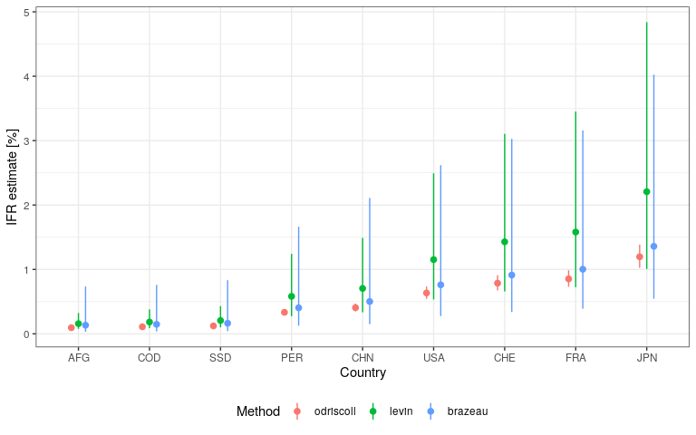
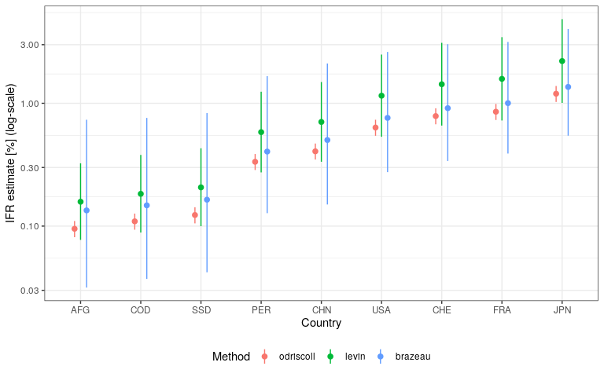

<!-- README.md is generated from README.Rmd. Please edit that file -->

# covidestim

<!-- badges: start -->

[](https://www.tidyverse.org/lifecycle/#experimental)
<!-- badges: end -->

An R package for estimating population-level covid19 outcome
probabilities (e.g. hospitalization|infection, death|hospitalization,
etc.), given the age-distribution of a population of interest and
severity estimates (by age, sex, etc.) from various research groups.

Includes functions to extract country-level age distributions from the
[UN World Population Prospects
2019](https://population.un.org/wpp/Download/Standard/Population/)
dataset, and age-severity estimates from:

  - [Salje et al. 2020](https://doi.org/10.1126/science.abc3517) (based
    on data from France)
  - [Neher Lab](https://doi.org/10.1101/2020.05.05.20091363) (China)
  - [Bi et al. 2020](https://doi.org/10.1101/2020.03.03.20028423)
    (Schenzhen, China)
  - [Davies et al. 2020](https://doi.org/10.1101/2020.03.24.20043018)
    and [van Zandvoort et
    al. 2020](https://doi.org/10.1101/2020.04.27.20081711) (China,
    Diamond Princess)
  - [O’Driscoll et al. 2020](https://doi.org/10.1038/s41586-020-2918-0)
    ensemble IFR (Infection Fatality Risk) estimates based on data from
    45 countries (published on 2 November 2020)
  - [Levin et
    al. 2020](https://www.medrxiv.org/content/10.1101/2020.07.23.20160895v6)
    meta regression IFR estimates based on data from 34 studies
    (published on 8 October 2020).
  - [Brazeau et
    al. 2020](https://www.imperial.ac.uk/mrc-global-infectious-disease-analysis/covid-19/report-34-ifr/)
    IFR estimates based on data from 10 studies (published on 29 October
    2020).

## Installation

Install from GitHub with:

``` r
# install.packages("remotes")
remotes::install_github("epicentre-msf/covidestim")
```

## Usage

#### Extract population age-distributions from UN World Population Prospects 2019

``` r
library(covidestim)

covidestim::get_age_pop(iso = "AFG", format = "long") # AFG = Afghanistan
#>    age_group       pop
#> 1        0-9 11088.732
#> 2      10-19  9821.559
#> 3      20-29  7035.871
#> 4      30-39  4534.646
#> 5      40-49  2963.459
#> 6      50-59  1840.198
#> 7      60-69  1057.496
#> 8      70-79   480.455
#> 9      80-89   100.065
#> 10     90-99     5.821
#> 11      100+     0.039
```

#### Derive population-wide covid19 outcome probability estimates

``` r
# mean probability of death|infection in Afghanistan, based on age-severity
# estimates from different research groups
covidestim::get_p_Salje("AFG", p_type = "p_dead_inf")
#> [1] 0.0008886
covidestim::get_p_Neher("AFG", p_type = "p_dead_inf")
#> [1] 0.001087
covidestim::get_p_LSHTM("AFG", p_type = "p_dead_inf")
#> [1] 0.006092
```

#### Compare estimates of Pr(hospitalization|infection) from various research groups

``` r
library(ggplot2)

p_hosp <- covidestim::compare_age_severity()

ggplot(p_hosp, aes(x = age_group, y = mean, color = group)) +
  geom_point(size = 3, position = position_dodge(width = 0.6)) +
  geom_linerange(aes(ymin = low95, ymax = upp95), position = position_dodge(width = 0.6)) +
  labs(x = "Age group", y = "Pr(hospitalization|infection)", col = "Group") +
  theme_bw()
```

<!-- -->

#### Compare Infection Fatality Risk (IFR) of different countries

Get age-adjusted IFR estimates for countries according to estimates by
[O’Driscoll et al. 2020](https://doi.org/10.1101/2020.08.24.20180851),
[Levin et al. 2020](https://doi.org/10.1101/2020.07.23.20160895) and
[Brazeau et
al. 2020](https://www.imperial.ac.uk/mrc-global-infectious-disease-analysis/covid-19/report-34-ifr/).

``` r
#get list of all countries with available population
cntrys <- c("AFG", "SSD", "COD", "CHN", "USA", "FRA", "CHE", "JPN", "PER")

#compute IFRs, sort ascending, add continent
ifr <- compare_IFR(cntrys)
ifr$iso <- factor(ifr$iso, levels = unique(ifr$iso[order(ifr$mn)]))

#plot
ggplot(ifr) +
  geom_point(aes(x = iso, y = 100*mn, color = method), position = position_dodge(width = .3), size = 2) +
  geom_linerange(aes(x = iso, ymin = 100*low, ymax = 100*up, color = method), position = position_dodge(width = .3)) +
  labs(
    x = "Country",
    y = "IFR estimate [%]",
    color = "Method"
  ) +
  theme_bw() +
  theme(legend.position = "bottom")
```

<!-- -->

Plotting the same figure on a log-scale we can see the differences in
countries with younger populations too:

``` r
ggplot(ifr) +
  geom_point(aes(x = iso, y = 100*mn, color = method), position = position_dodge(width = .3), size = 2) +
  geom_linerange(aes(x = iso, ymin = 100*low, ymax = 100*up, color = method), position = position_dodge(width = .3)) +
  labs(
    x = "Country",
    y = "IFR estimate [%] (log-scale)",
    color = "Method"
  ) +
  theme_bw() +
  theme(legend.position = "bottom") +
  scale_y_log10()
```

<!-- -->

We can see that the differences in the estimated IFR come directly from
the different age-specific IFR estimates by the two groups of authors:

``` r
library(magrittr)

est_levin <- get_est_levin() %>% dplyr::mutate(method = "levin")
est_odriscoll <- get_est_odriscoll(sex = "total") %>% dplyr::mutate(method = "odriscoll")
est_brazeau <- get_est_brazeau() %>% dplyr::mutate(method = "brazeau")

est <- dplyr::bind_rows(
    est_levin,
    est_odriscoll,
    est_brazeau
  ) %>%
  dplyr::select(-sex, -quantile) %>%
  tidyr::pivot_wider(names_from = stat, values_from = "p_dead_inf") %>%
  dplyr::mutate(
    method = factor(method, levels = c("odriscoll", "levin", "brazeau")),
    age_group = factor(age_group,
      levels = c("0-4", "5-9", "10-14", "15-19", "20-24", "25-29", "30-34", "35-39",
        "40-44", "45-49", "50-54", "55-59", "60-64", "65-69", "70-74", "75-79",
        "80-84", "85-89", "80+", "85+", "90+")),
    )

ggplot(est) +
  geom_point(aes(age_group, 100*mean, col = method), size = 2, position = position_dodge(width = 0.4)) +
  geom_linerange(aes(age_group, ymin = 100*low_95, ymax = 100*up_95, col = method), position = position_dodge(width = 0.4)) +
  labs(
    x = "Age-group",
    y = "IFR estimate [%] (log-scale)",
    color = "Method"
  ) +
  scale_y_log10() +
  theme_bw() +
  theme(legend.position = "bottom")
```

<!-- -->

Note that the ranges of the oldest age-groups are not matching exactly
between the two estimates.
